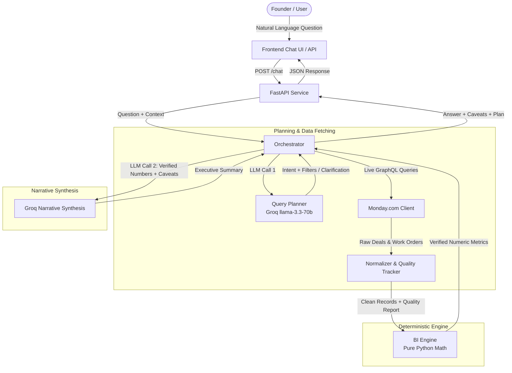

# Skylark Drones — Monday.com Live BI Agent

A natural-language Business Intelligence Agent for leadership at Skylark Drones. It dynamically fetches live operational and sales data from Monday.com boards, executes deterministic mathematical and statistical calculations, and generates concise executive narratives with explicit data quality caveats.

---

## 🏗️ Architecture



### Key Principles
1. **Zero Arithmetic by LLM**: The language model never performs calculations. All aggregations, pipeline sums, win-rates, and billing breakdowns are strictly computed by Python functions in [bi_engine.py](file:///src/bi_engine.py).
2. **100% Live Dynamic Queries**: No stale CSV files, static dumps, or caching databases. Every request queries live Monday.com GraphQL endpoints.
3. **Clarification Loops**: Underspecified questions prompt targeted clarifying questions rather than guessing user intent.
4. **Data Quality Awareness**: Missing fields, unparseable dates/numbers, and uncanonicalized sector tags are systematically tracked and surfaced as inline caveats to leadership.
5. **Resilient to Partial Outages**: If one board fails (e.g. Work Orders rate limit), the agent still completes calculations for the available board and notifies the user.

---

## 🚀 Quickstart & Local Setup

### 1. Prerequisites
- Python 3.10+
- A valid Monday.com API Token & Board IDs
- A Groq API Key

### 2. Installation
```bash
# Clone and enter directory
cd monday-live-bi-agent

# Create and activate virtual environment
python -m venv venv
# On Windows:
venv\Scripts\activate
# On Linux/macOS:
# source venv/bin/activate

# Install dependencies
pip install -r requirements.txt
```

### 3. Environment Variables
Create a `.env` file from the provided `.env.example`:
```ini
MONDAY_API_TOKEN=your_monday_api_token
MONDAY_API_URL=https://api.monday.com/v2
DEALS_BOARD_ID=your_deals_board_id
WORK_ORDERS_BOARD_ID=your_work_orders_board_id
GROQ_API_KEY=your_groq_api_key
```

### 4. Running the Application
```bash
# Start FastAPI backend and serve static frontend
uvicorn src.api:app --reload --port 8000
```
Open [http://localhost:8000](http://localhost:8000) in your browser to interact with the chat UI.

---

## 🧪 Verification & Test Suite

Run individual phase tests or all tests sequentially:

```bash
# Test Phase 1: Live Monday.com Connection & Schema Inspection
python main.py

# Test Phase 2: Data Normalization & Quality Reporting
python test_phase2.py

# Test Phase 3: Deterministic BI Engine Metrics
python test_phase3.py

# Test Phase 4: Groq Query Planner & Clarification Logic
python test_phase4.py

# Test Phase 5: Orchestrator End-to-End & Partial Failure Resilience
python test_phase5.py
```

---

## 🌐 API Reference

### `POST /chat`
Submits a query to the BI agent.

**Request Body:**
```json
{
  "question": "How is the Mining sector performing overall?",
  "history": [
    {"role": "user", "content": "Hello"},
    {"role": "assistant", "content": "Hi! How can I assist you with business metrics?"}
  ]
}
```

**Response Body:**
```json
{
  "answer": "Mining sector sales pipeline stands at ₹1.2M across 8 deals...",
  "clarification_needed": false,
  "clarification_question": null,
  "data_quality_notes": [
    "Deals: 1 item(s) had missing fields (Masked Deal value: 1)."
  ],
  "query_plan": {
    "intent": "cross_board_sector_view",
    "filters": {"sector": "Mining"},
    "needs_clarification": false
  },
  "partial_failure": false,
  "partial_failure_reason": null
}
```

### `GET /health`
Returns health check status and service version.

---

## ☁️ Deployment (Render)

This repository includes a [`render.yaml`](file:///render.yaml) blueprint:
1. Connect your repository to [Render.com](https://render.com).
2. Create a new Web Service using the repo.
3. Configure the environment variables in the Render dashboard (`MONDAY_API_TOKEN`, `DEALS_BOARD_ID`, `WORK_ORDERS_BOARD_ID`, `GROQ_API_KEY`).
4. The service will automatically build via `pip install -r requirements.txt` and start with `uvicorn src.api:app --host 0.0.0.0 --port $PORT`.

---

## 📁 Repository Structure

```
├── .env.example
├── DECISION_LOG.md           # Architectural decision records
├── Makefile                  # Helper commands for test & run
├── README.md                 # Project documentation
├── render.yaml               # Cloud deployment blueprint
├── requirements.txt          # Python dependencies
├── main.py                   # Phase 1 verification script
├── test_phase2.py            # Phase 2 test suite
├── test_phase3.py            # Phase 3 test suite
├── test_phase4.py            # Phase 4 test suite
├── test_phase5.py            # Phase 5 test suite
├── frontend/                 # Client UI
│   ├── index.html            # Dark glassmorphism chat interface
│   ├── style.css             # Design tokens & responsive styles
│   └── app.js                # Chat controller & state management
└── src/                      # Backend implementation
    ├── config.py             # Environment configuration & validation
    ├── monday_client.py      # Live GraphQL client with retry/backoff
    ├── data_quality.py       # Data issue logger & summarizer
    ├── normalizer.py         # Type, date, currency, sector normalization
    ├── bi_engine.py          # Deterministic metric calculator
    ├── query_planner.py      # Groq-powered intent extractor
    ├── orchestrator.py       # Pipeline wiring & narrative synthesis
    └── api.py                # FastAPI endpoints & static file serving
```