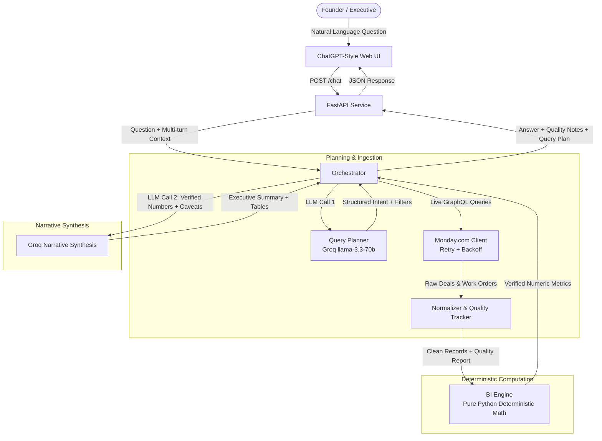

# 🦅 Skylark Drones — Monday.com Live BI Agent

> **Live Production URL:** **[https://monday-live-bi-agent.onrender.com](https://monday-live-bi-agent.onrender.com)**  
> **GitHub Repository:** **[https://github.com/VijaySaravanaPandi/monday-live-bi-agent](https://github.com/VijaySaravanaPandi/monday-live-bi-agent)**

A conversational Business Intelligence Agent designed for founders and executives at Skylark Drones. It dynamically queries live operational (Work Orders) and commercial (Deals) data from Monday.com via GraphQL, executes deterministic mathematical calculations with **zero arithmetic hallucination**, and synthesizes concise, founder-level briefings with explicit data quality caveats.

---

## 🌐 Live Demo & Hosted Application

| Resource | Link | Description |
| :--- | :--- | :--- |
| **Live Web App** | [https://monday-live-bi-agent.onrender.com](https://monday-live-bi-agent.onrender.com) | Production deployed on Render |
| **API Health Check** | [https://monday-live-bi-agent.onrender.com/health](https://monday-live-bi-agent.onrender.com/health) | Real-time service liveness probe |
| **Chat Endpoint** | `POST https://monday-live-bi-agent.onrender.com/chat` | Multi-turn conversational JSON API |

---

## ⚡ Core Capabilities & Highlights

1. **🔒 Zero-Arithmetic LLM Guarantee**:
   The LLM **never** performs math or metric calculation. All aggregation, pipeline summation, win-rate computation, and billing status calculations are deterministically computed in pure, unit-tested Python ([`src/bi_engine.py`](file:///src/bi_engine.py)).
2. **🔄 100% Live Dynamic Queries**:
   Zero static CSVs or caching databases. Every query executes live against Monday.com's GraphQL v2 API with exponential backoff and retry handlers ([`src/monday_client.py`](file:///src/monday_client.py)).
3. **💬 ChatGPT-Style Left-Aligned Interface**:
   - Clean, left-aligned conversation stream.
   - **Persistent Multi-Thread History** stored in `localStorage` with a sidebar drawer.
   - **Interactive Quick-Prompt Bar** directly above the input box for instant one-click analysis.
   - **Terminator Button**: Instant request cancellation via `AbortController`.
   - **Rich Markdown Tables**: Structured comparisons and distributions rendered in glassmorphic tables.
4. **🛡️ Transparent Data Quality Tracking**:
   Surfaces missing deal values, uncanonical sector labels, and missing status fields as collapsible inline caveat drawers ([`src/data_quality.py`](file:///src/data_quality.py)).
5. **🎯 Smart Intent Resolution & Clarification**:
   Ambiguous or underspecified queries trigger targeted clarification loops instead of hallucinated answers ([`src/query_planner.py`](file:///src/query_planner.py)).
6. **⚡ Partial Outage Resilience**:
   If one board encounters rate-limiting or schema issues, the orchestrator continues with the available board and alerts the user transparently.

---

## 🏗️ System Architecture



---

## 💻 Local Setup & Development

### 1. Prerequisites
- Python 3.10+
- A valid Monday.com API Token & Board IDs
- A Groq Cloud API Key

### 2. Clone & Install
```bash
# Clone the repository
git clone https://github.com/VijaySaravanaPandi/monday-live-bi-agent.git
cd monday-live-bi-agent

# Create and activate virtual environment
python -m venv venv
# On Windows:
.\venv\Scripts\Activate.ps1
# On Linux/macOS:
source venv/bin/activate

# Install dependencies
pip install -r requirements.txt
```

### 3. Environment Variables
Create a `.env` file in the root directory:
```ini
MONDAY_API_TOKEN=your_monday_api_token
MONDAY_API_URL=https://api.monday.com/v2
DEALS_BOARD_ID=5030965546
WORK_ORDERS_BOARD_ID=5030965777
GROQ_API_KEY=your_groq_api_key
```

### 4. Run the Application
```bash
# Start FastAPI backend with live reload
uvicorn src.api:app --reload --port 8000
```
Open [http://localhost:8000](http://localhost:8000) in your browser.

---

## 🧪 Test Suite & Verification

The repository includes standalone phase verification scripts:

```bash
# Phase 1: Live Monday.com Connection & GraphQL Query Verification
python main.py

# Phase 2: Data Normalization & Data Quality Reporting
python test_phase2.py

# Phase 3: Deterministic BI Metrics Engine
python test_phase3.py

# Phase 4: Groq Query Planner & Clarification Routing
python test_phase4.py

# Phase 5: End-to-End Orchestrator & Partial Failure Resilience
python test_phase5.py
```

---

## 📡 API Reference

### `POST /chat`
Executes an end-to-end natural language BI analysis.

**Request:**
```json
{
  "question": "How is the Mining sector performing across sales and operations?",
  "history": [
    {"role": "user", "content": "Hello"},
    {"role": "assistant", "content": "Hi! How can I assist you with business metrics?"}
  ]
}
```

**Response:**
```json
{
  "answer": "**Mining Sector Overview**\n\n| Metric | Value |\n| :--- | :--- |\n| Sales Pipeline | ₹12.5M (8 deals) |\n| Delivered Work Orders | 14 completed |\n| Outstanding Receivable | ₹1.8M |\n\n*Data quality note: 2 records had unverified deal values.*",
  "clarification_needed": false,
  "clarification_question": null,
  "data_quality_notes": [
    "Deals: 347 items checked. 188 item(s) had missing fields (Masked Deal value: 182, Deal Status: 2, Sector/service: 9)."
  ],
  "query_plan": {
    "intent": "cross_board_sector_view",
    "filters": {"sector": "Mining"},
    "needs_clarification": false,
    "reasoning": "The user asks for sector-wide performance across sales and operations."
  },
  "partial_failure": false,
  "partial_failure_reason": null
}
```

### `GET /health`
Liveness probe returning server status and version:
```json
{"status": "ok", "version": "1.0.0", "service": "skylark-bi-agent"}
```

---

## 📂 Repository File Structure

```
├── .env.example
├── .gitignore
├── Makefile                  # Helper commands for test & run
├── README.md                 # Complete documentation & live link
├── render.yaml               # Cloud deployment blueprint for Render
├── runtime.txt               # Python runtime version for hosting
├── requirements.txt          # Production dependencies
├── package_submission.py     # Clean submission zip generator
├── main.py                   # Phase 1 verification script
├── test_phase2.py            # Phase 2 test suite
├── test_phase3.py            # Phase 3 test suite
├── test_phase4.py            # Phase 4 test suite
├── test_phase5.py            # Phase 5 test suite
├── frontend/                 # Client UI
│   ├── index.html            # ChatGPT-style command center layout
│   ├── style.css             # Glassmorphic theme & responsive typography
│   └── app.js                # State management, history, abort controller & table parser
└── src/                      # Backend implementation
    ├── config.py             # Environment configuration & validation
    ├── monday_client.py      # Live GraphQL client with retry/backoff
    ├── data_quality.py       # Data issue logger & summarizer
    ├── normalizer.py         # Type, date, currency, sector normalization
    ├── bi_engine.py          # Deterministic metric calculator (zero LLM math)
    ├── query_planner.py      # Groq-powered intent extractor & clarification
    ├── orchestrator.py       # Pipeline wiring & narrative synthesis
    └── api.py                # FastAPI endpoints & static file serving
```

---

## 👨‍💻 Author & Maintainer
* **Developer**: Vijay Saravana Pandi
* **Email**: vijaysaravanapandit@gmail.com
* **GitHub**: [@VijaySaravanaPandi](https://github.com/VijaySaravanaPandi)